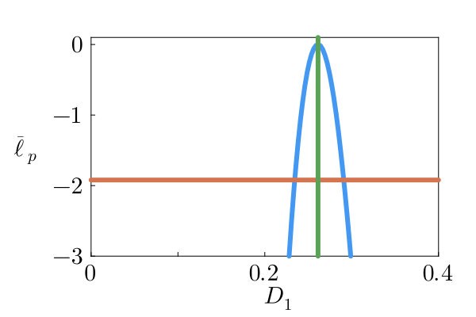
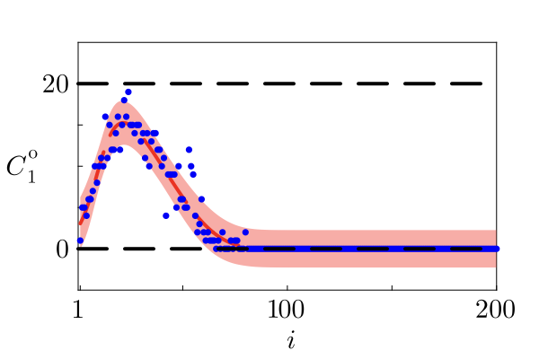
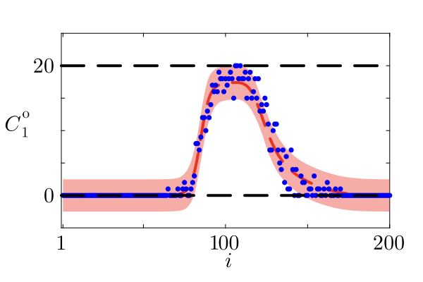
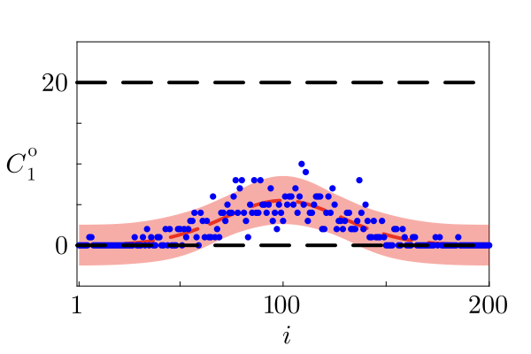

# Statistical Modelling of Advection-Diffusion Processes in Julia

## Overview
This repository contains a high-performance statistical modelling framework for calibrating Advection-Diffusion Partial Differential Equations (PDEs) to noisy experimental data. Written in **Julia**, the project leverages the language's speed and rich scientific ecosystem to perform rigorous parameter estimation and uncertainty quantification exercises.

The core objective is to infer transport parameters (Diffusivity $D$, Velocity $v$) and population growth rates from count data, utilising Maximum Likelihood Estimation (MLE) and profile likelihood analysis to assess parameter identifiability.

## Key Features
- **PDE Solvers**: Finite-difference implementations of Advection-Diffusion-Reaction equations using custom solvers and `DifferentialEquations.jl`.
- **Statistical Inference**:
  - **Maximum Likelihood Estimation (MLE)**: Optimisation of log-likelihood functions using `NLopt.jl`.
  - **Profile Likelihood**: Robust identifiability analysis to construct confidence intervals and detect practical non-identifiability.
  - **Rejection Sampling**: Monte Carlo methods to propagate parameter uncertainty into model predictions.
- **Model Selection**: Comparison of Additive Gaussian and Multinomial noise models to determine the best fit for count data.

## Technical Stack
- **Language**: Julia v1.x
- **Libraries**:
  - `DifferentialEquations.jl`: Numerical solving of differential equations.
  - `NLopt.jl`: Non-linear optimization for MLE.
  - `Plots.jl` & `LaTeXStrings.jl`: Publication-quality visualisation.
  - `Distributions.jl`: Probabilistic modelling.
  - `DataFrames.jl` & `CSV.jl`: Data manipulation.

## Methodology

### 1. Mathematical Formulation
The underlying dynamics are described by the Advection-Diffusion equation:

$$ \frac{\partial C}{\partial t} = D \frac{\partial^2 C}{\partial x^2} - v \frac{\partial C}{\partial x} + R(C) $$

where $C(x,t)$ represents the population density, $D$ is the diffusivity, $v$ is the advection velocity, and $R(C)$ represents reaction/growth terms (e.g., Logistic growth).

### 2. Parameter Estimation
We employ a frequentist approach to parameter estimation. The log-likelihood function $\ell(\theta)$ is maximised to find the MLE $\hat{\theta}$:

$$ \hat{\theta} = \underset{\theta}{\arg\max} \mathcal{L}(\theta | \text{Data}) $$

Uncertainty is quantified using Profile Likelihood, where we inspect the curvature of the likelihood surface around the MLE to derive asymptotic confidence intervals based on the $\chi^2$ distribution.


*Figure 1: Univariate Profile Likelihood for Diffusivity ($D_1$). The horizontal line indicates the 95% confidence threshold.*

### 3. Prediction Intervals
Using parameters sampled from within the 95% confidence region (via rejection sampling), we construct prediction intervals for the model trajectory. This allows us to visually assess the goodness-of-fit and the precision of our estimates.


*Figure 2: Case 1 - Model realisation (red dash) vs Data (blue dots) with 95% Prediction Interval (red shaded).*

## Case Studies

### Case 1: Single Population Dynamics
Analysis of a single species undergoing advection and diffusion. The model successfully captures the spreading and translation of the population front.

### Case 2: Multi-Population / Complex Geometry
Extension of the framework to more complex scenarios, potentially involving interacting subpopulations or variable boundary conditions.


*Figure 3: Case 2 - Model prediction demonstrating robustness in more complex parameter regimes.*

### Case 3: Advanced Scenarios
Further application of the framework to test the limits of parameter identifiability and model selection criteria.


*Figure 4: Case 3 - High-fidelity tracking of population dynamics under stochastic noise.*

## Usage
To reproduce the results:
1.  Clone the repository.
2.  Ensure Julia is installed.
3.  Instantiate the environment:
    ```julia
    using Pkg
    Pkg.activate(".")
    Pkg.instantiate()
    ```
4.  Run the desired case script (e.g., `include("Case1/AdditiveGaussian/AdditveGaussian.jl")`).

## Future Work
- Implementation of Bayesian Inference using `Turing.jl` for full posterior estimation.
- Extension to 2D spatial domains.
- Integration of Stochastic Differential Equations (SDEs) to model intrinsic noise.
